# Список дефектов, найденных при тестировании страницы http://tech-avito-intern.jumpingcrab.com/

**Оглавление:**  
- [1. Кнопка "Найти" некликабельна на странице каталога бъявлений](#1-кнопка-найти-некликабельна-на-странице-каталога-бъявлений)
- [2. Ломаются элементы каталога на некоторых разрешениях экрана](#2-ломаются-элементы-каталога-на-некоторых-разрешениях-экрана)
- [3. Кнопка сохранения нового объявления имеет неверные размеры](#3-кнопка-сохранения-нового-объявления-имеет-неверные-размеры)
- [4. Название поля для выбора количества отображаемых на старнице объявлений написано на английском языке](#4-название-поля-для-выбора-количества-отображаемых-на-старнице-объявлений-написано-на-английском-языке)
- [5. Есть возможность сохранить отредактированное объявление с пустыми полями](#5-есть-возможность-сохранить-отредактированное-объявление-с-пустыми-полями)
- [6. Нет названия полей в режиме редактирования объявления](#6-нет-названия-полей-в-режиме-редактирования-объявления)

---

## 1. Кнопка "Найти" некликабельна на странице каталога бъявлений

### Окружение:
- Браузер Google Chrome Версия 131.0.6778.205 (Официальная сборка), (x86_64)

### Критичность: Низкая 
*(не влияет на сам поиск карточек)*

### Приоритет: Высокий
*(Путает пользователя, напр., если по введенному названию ничего не нашлось автоматически, то он будет жать на кнопку, думая, что она не работает. Неверная работа логики)*

### Шаги воспроизведения:
1. Открыть страницу http://tech-avito-intern.jumpingcrab.com/
2. Ввести название объявления в строку поиска
3. Нажать кнопку "Найти"

### Фактический результат:
Поиск объявления происходит после ввода текста, а не после нажатия на кнопку. При наведении мышки на "Найти" она становится неактивной и некликабельной:  

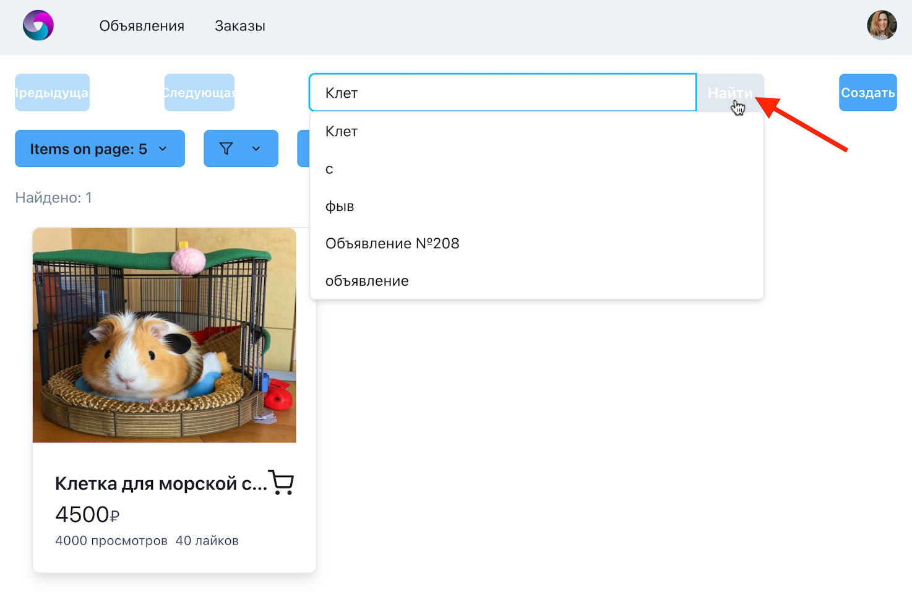

### Ожидаемый результат:
Кнопка "Найти" кликабельная. Поиск осуществляется по ее нажатию

---

## 2. Ломаются элементы каталога на некоторых разрешениях экрана

### Окружение:
- Браузер Google Chrome Версия 131.0.6778.205 (Официальная сборка), (x86_64)

### Критичность: Низкая
*(не влияет на работу системы)*
### Приоритет: Средний
*(имиджевое влияние)*

### Шаги воспроизведения:
1. Открыть страницу http://tech-avito-intern.jumpingcrab.com/  
2. Открыть консоль разработчика и включить режим "toogle devices toolbar" (ctrl + shift + m):  
    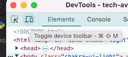
3. Проверить, как отображается каталог на разрешениях 1024px, 768px, 425px и 320px  

### Фактический результат:
1. Карточки объявлений перекрывают друг друга
2. Названия кнопок и текст в плейсхолдере начинают обрезаться/вылезать за пределы кнопки:

#### 1024px
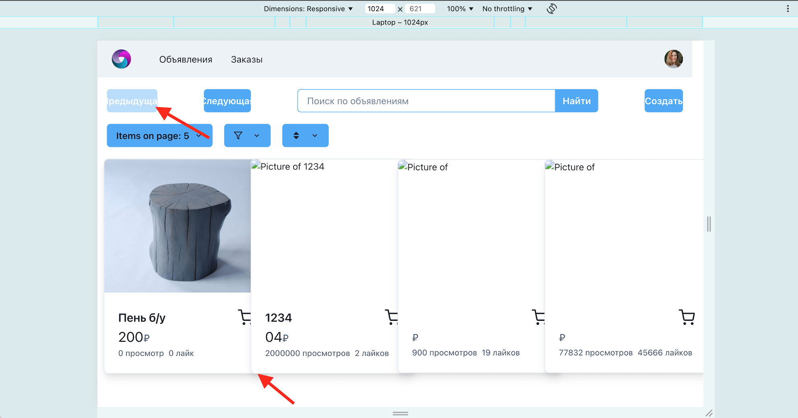

#### 768px
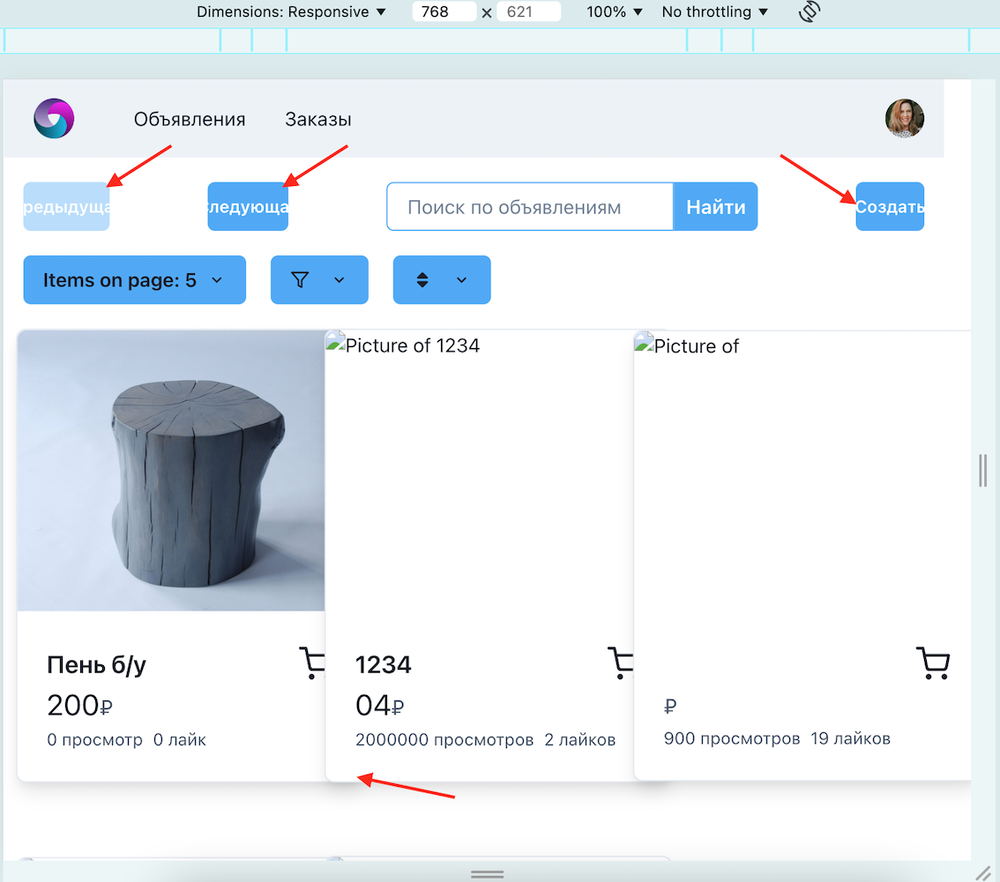

#### 425px
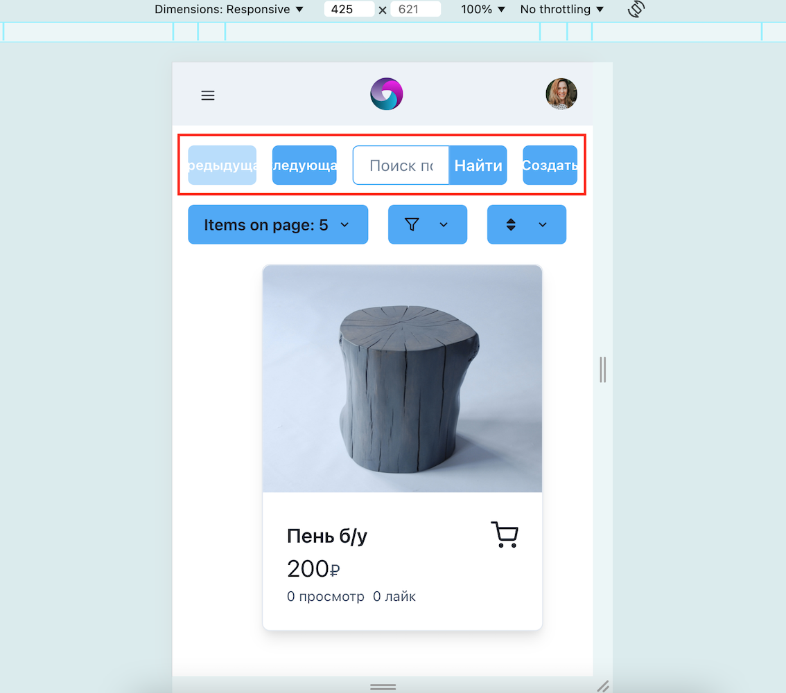

#### 320px
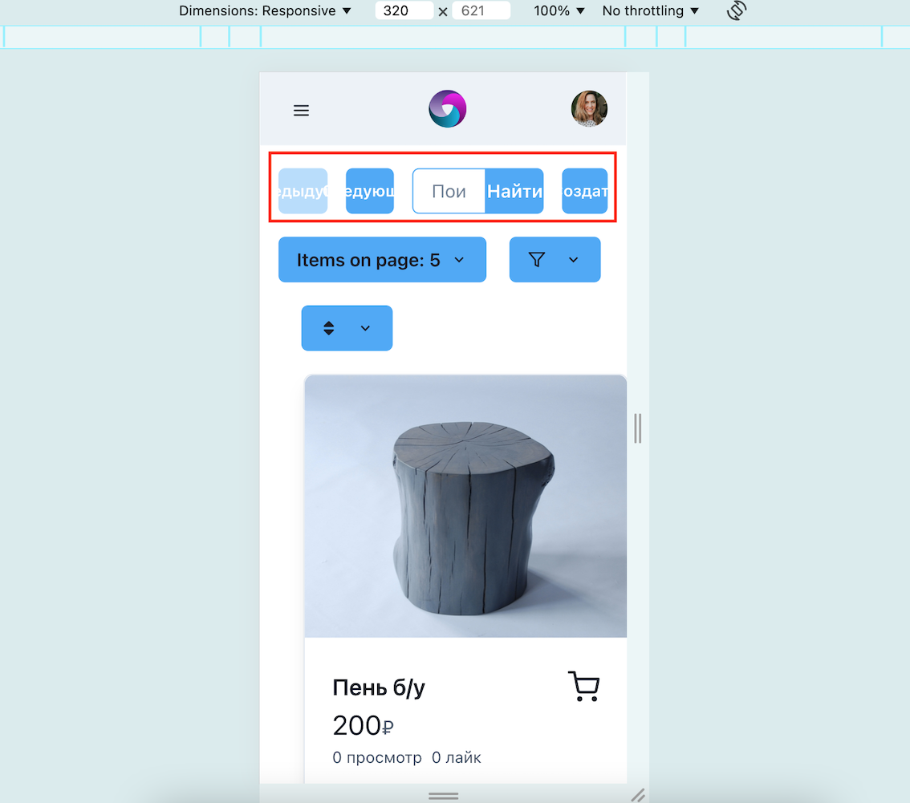

### Ожидаемый результат:
- Карточки каталога адаптируются под размер экрана и не перекрывают друг друга  
- Текст "Предыдущая", "Следующая", "Найти" и "Создать", а также текст в плейсхолдере адаптируются под размеры экрана  
  *(либо размещение/размер самих кнопок - завист от требований)*

---

## 3. Кнопка сохранения нового объявления имеет неверные размеры

### Окружение:
- Браузер Google Chrome Версия 131.0.6778.205 (Официальная сборка), (x86_64)

### Критичность: Низкая
*(не влияет на функционал кнопки)*
### Приоритет: Средний
*(имиджевое влияние)*

### Шаги воспроизведения:
1. Открыть страницу http://tech-avito-intern.jumpingcrab.com/
2. Нажать кнопку "Создать"

### Фактический результат:
Ширина кнопки "Сохранить" в открывшимся модальном окне не соответствует остальным полям. Также эта кнопка "прилипла" к низу формы и не имеет отступа от него:  

### Ожидаемый результат:
- Высота и ширина кнопки такие же как и у полей для заполнения данных об объявлении  
- Есть отступ между кнопкой и нижней границей модального окна

---

## 4. Название поля для выбора количества отображаемых на старнице объявлений написано на английском языке

### Окружение:
- Браузер Google Chrome Версия 131.0.6778.205 (Официальная сборка), (x86_64)

### Критичность: Низкая
*(не влияет на функционал кнопки)*
### Приоритет: Средний
*(все поля в кнопках/фильтрах должны быть на одном языке)*

### Шаги воспроизведения:
1. Открыть страницу http://tech-avito-intern.jumpingcrab.com/
2. Проверить язык описания кнопок в шапке сайта

### Фактический результат:
Язык выбора количества объявлений на странице английский, а во всех остальных кнопках - русский:  

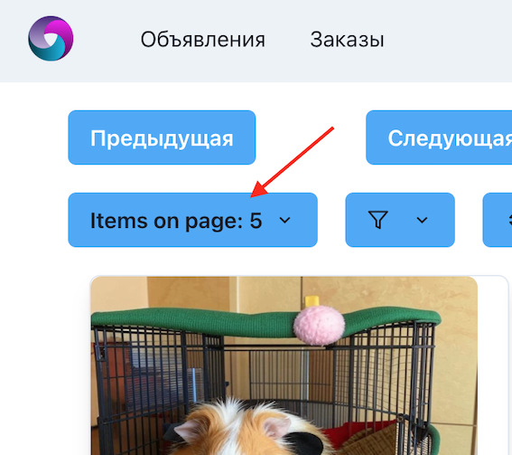

### Ожидаемый результат:
Язык в кнопках одинаковый (русский).
Например:  

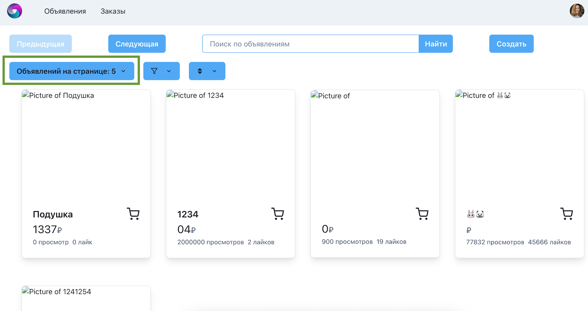

---

## 5. Есть возможность сохранить отредактированное объявление с пустыми полями

### Окружение:
- Браузер Google Chrome Версия 131.0.6778.205 (Официальная сборка), (x86_64)

### Критичность: Низкая
*(не влияет на функционал)*
### Приоритет: Высокий
*(при создании объявления все 4 поля обязательные. Скорее всего и при редактировании эти поля также должны быть обязательными, чтобы не было ломанных объявлений)*

### Шаги воспроизведения:
1. Открыть страницу http://tech-avito-intern.jumpingcrab.com/
2. Открыть карточку объявления
3. Перейти в режим редактирования
4. Оставить любое поле пустым
5. Сохранить изменения

### Фактический результат:
Можно сохранить объявление с пустыми полями:  

*1. Экран редактирования*
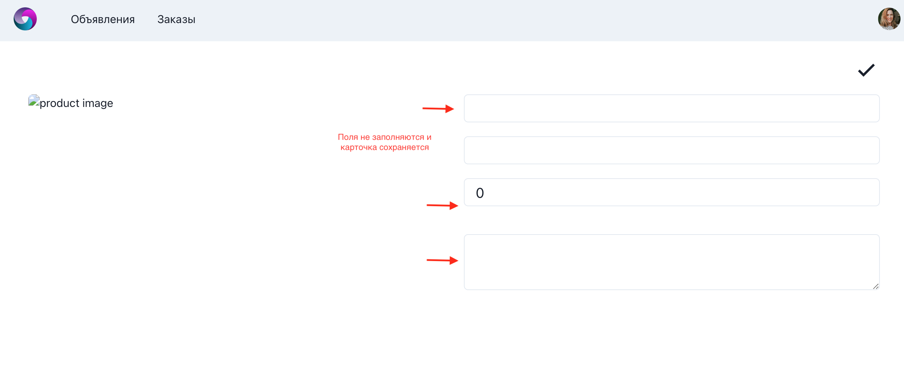

*2. Экран объявления*
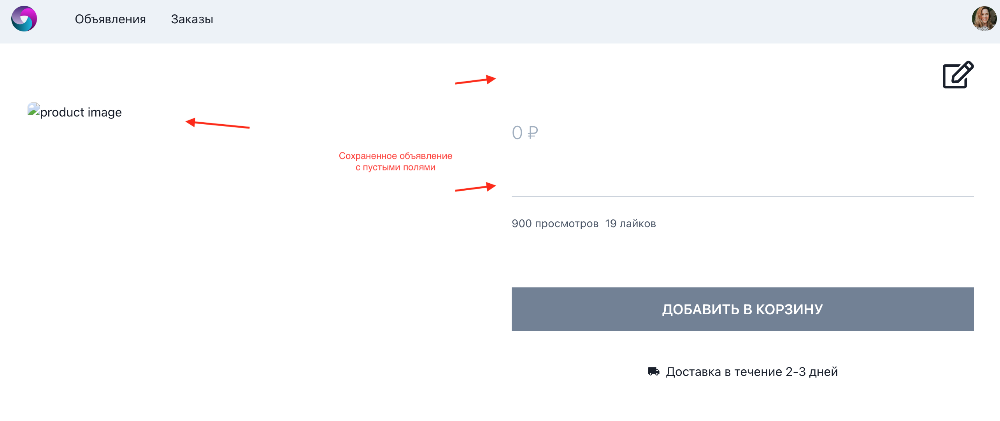

### Ожидаемый результат:
Поля обязательные для заполнения как и при создании объявления

---

## 6. Нет названия полей в режиме редактирования объявления

### Окружение:
- Браузер Google Chrome Версия 131.0.6778.205 (Официальная сборка), (x86_64)

### Критичность: Низкая
*(не влияет на функционал)*
### Приоритет: Высокий
*(неясно, где какое поле)*

### Шаги воспроизведения:
1. Открыть страницу http://tech-avito-intern.jumpingcrab.com/
2. Открыть карточку объявления
3. Перейти в режим редактирований
4. Проверить названия полей для редактирования

### Фактический результат:
Нет названия у полей

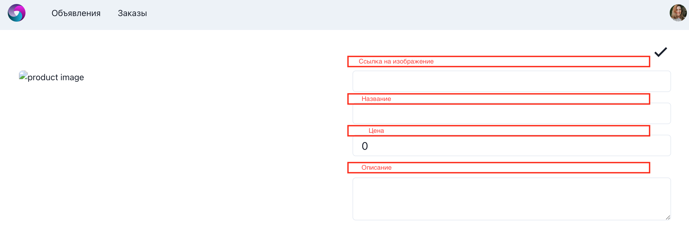  

### Ожидаемый результат:
Каждое поле подписано (напр., как в модальном окне создания объявления)
