# Задание 1.

1. Значок карты выделен жирным шрифтом, но на нем отображается меню с элементами.
   
   Приоритет: **high**.
2. Выбран для сортировки цен от дорогих к дешевым, но сортировка не работает.
   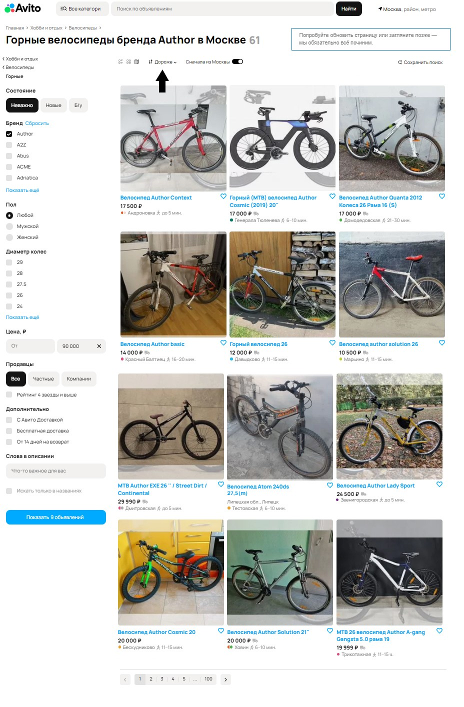
   Приоритет: **medium**.
3. Не отображается цена объявления.
   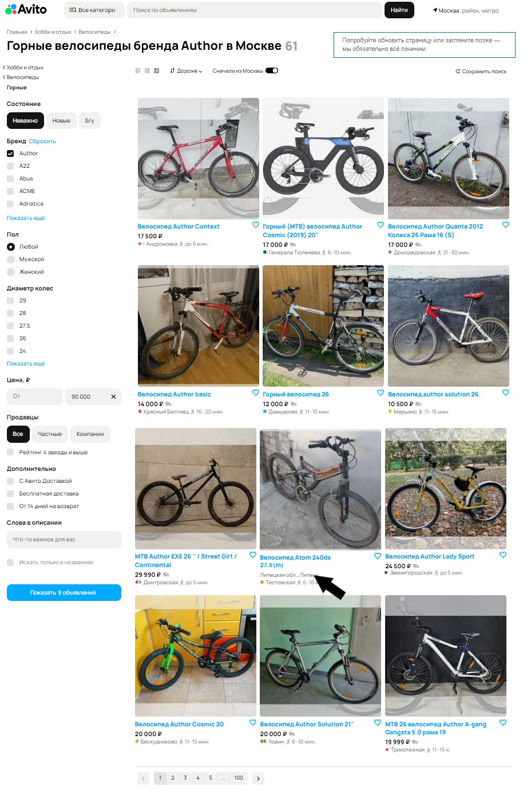
   Приоритет: **medium**.
4. В фильтре брендов выбрано "Author", но есть некоторые объявления, не относящиеся к этому фильтру.
   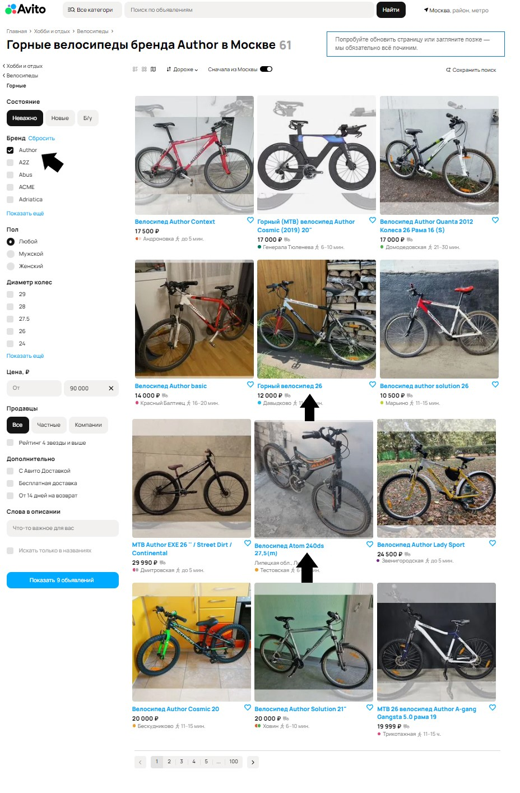
   Приоритет: **medium**.
5. В гендерном фильтре он не отображается "для всех"..
   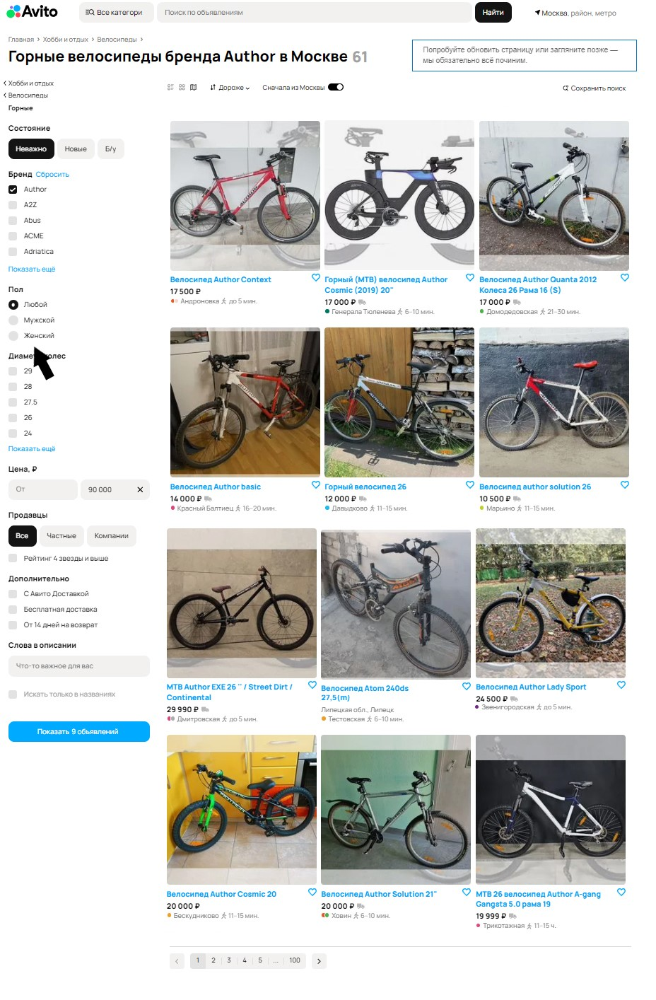
   Приоритет: **low**.
6. В кнопке применения фильтра показано, что есть всего 9 объявлений, но в результатах написано, что есть 61 результат и есть 100 страниц.
   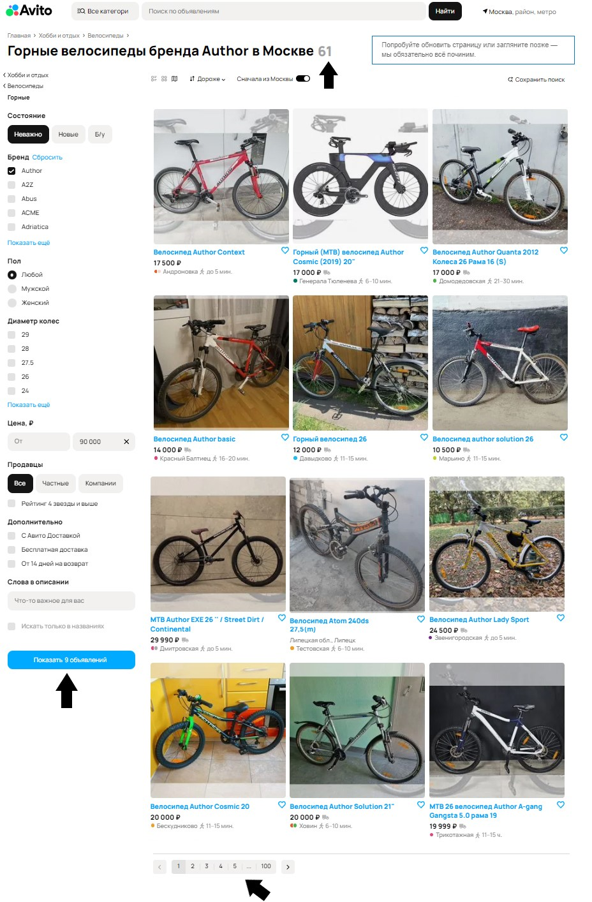
   Приоритет: **low**.
7. Написано, что там 61 объявление, но их больше, так как там 100 страниц.
   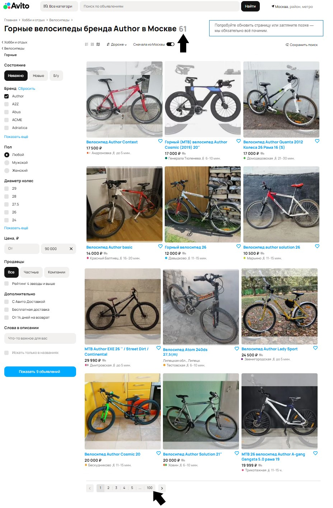
   Приоритет: **low**.
8. Этих слов здесь быть не должно.
   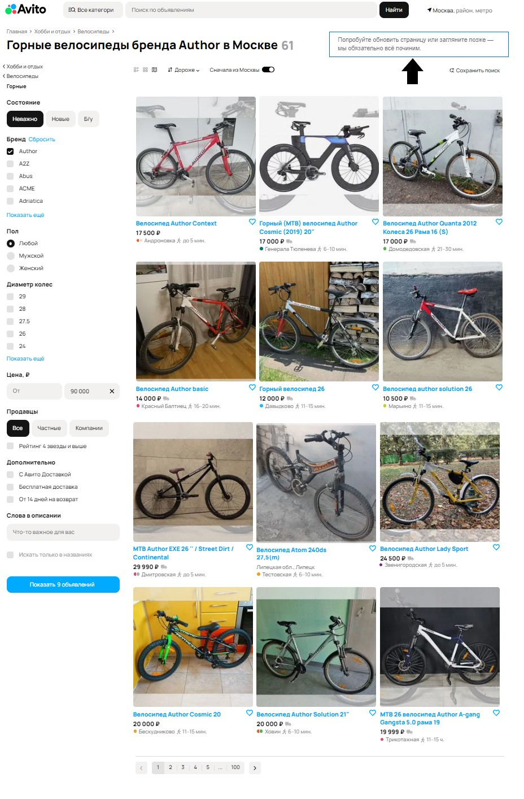
   Приоритет: **low**.
9. Такого метро в Москве не существует.
   
   Приоритет: **high**.
10. Неправильное написание названия метро.
    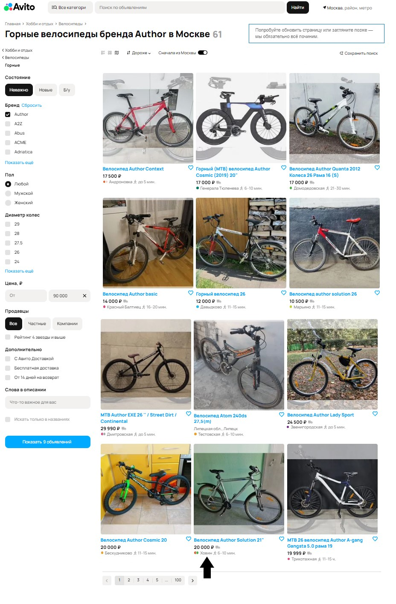
    Приоритет: **medium**.
11. В этом объявлении время в пути до метро указано в часах, а должно быть в минутах.
    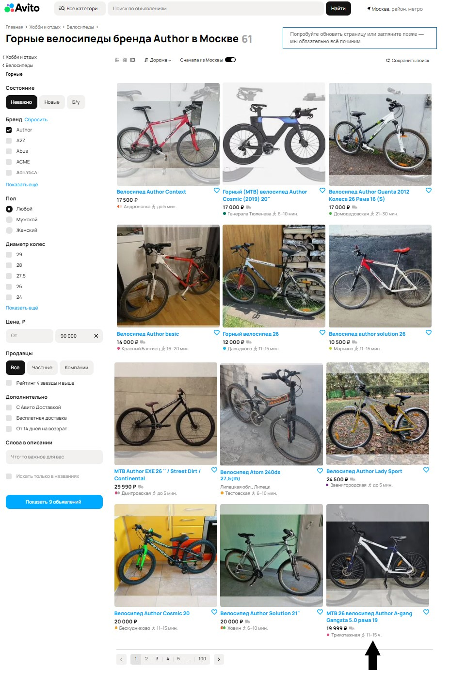
    Приоритет: **low**.
12. Диаметр указан в метрах, так как он должен быть в сантиметрах.
    
    Приоритет: **low**.
13. Фильтр по городам не работает, так как он должен показывать только добавления из Москвы, но это добавление из другого города, и в то же время у него есть метро из Москвы.
    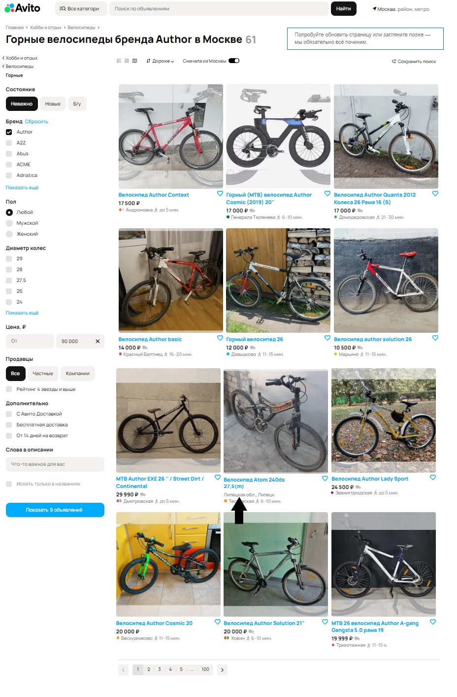
    Приоритет: **medium**.
14. На фотографии неправильное соотношение сторон.
    
    Приоритет: **low**.
15. Это пространство должно быть использовано.
    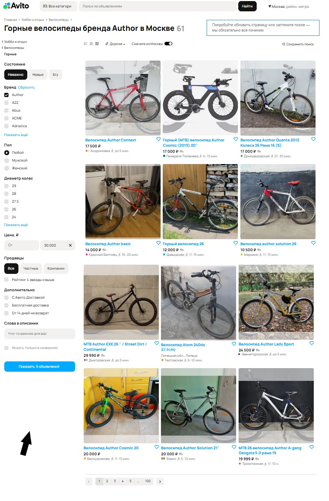
    Приоритет: **low**.
